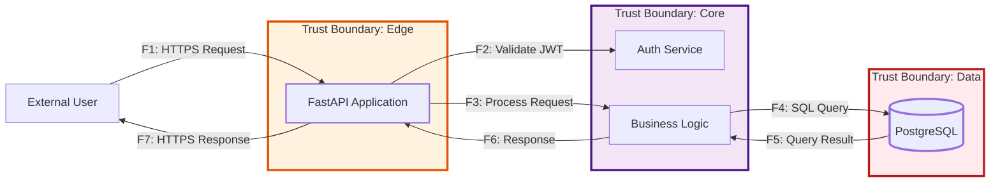
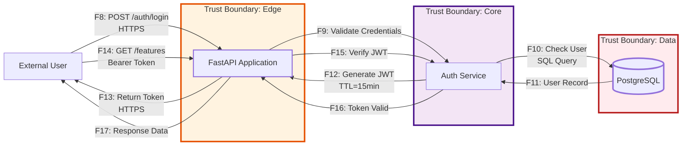

# Data Flow Diagram (DFD)

Данный документ содержит диаграмму потоков данных (DFD) системы с обозначением границ доверия, внешних участников, хранилищ и протоколов/каналов связи.

## 1) DFD (Mermaid) — основная схема с границами доверия

## 2) DFD — альтернативный сценарий (аутентификация пользователя)

## 3) Описание границ доверия (Trust Boundaries)

| Граница | Описание | Компоненты | Уровень доверия |
|---------|----------|------------|-----------------|
| **Edge** | Точка входа в систему | FastAPI Application | **Low Trust** — первый контакт с пользователем, валидация всех входящих данных |
| **Core** | Бизнес-логика приложения | Auth Service, Business Logic | **Medium Trust** — доверенный код, обработка запросов |
| **Data** | Хранилище данных | PostgreSQL Database | **High Trust** — критичные данные, строгий контроль доступа |

## 4) Внешние участники (External Entities)

| Участник | Описание | Уровень доверия |
|----------|----------|-----------------|
| **External User** | Пользователь системы (аутентифицированный или анонимный) | **Untrusted** — все данные должны быть валидированы |

## 5) Хранилища данных (Data Stores)

| Хранилище | Тип данных | Чувствительность | Защита |
|-----------|------------|------------------|--------|
| **PostgreSQL** | Пользовательские данные, Features, метаданные | **HIGH** — содержит бизнес-данные | Аутентификация, шифрование соединений, резервное копирование |

## 6) Протоколы и каналы связи

| Поток | Протокол | Шифрование | Описание |
|-------|----------|------------|----------|
| F1, F7, F8, F13, F14, F17 | HTTPS | TLS 1.3 | Внешние запросы между пользователем и API |
| F2, F3, F6, F9, F12, F15, F16 | Internal | None | Внутренние вызовы между компонентами приложения |
| F4, F5, F10, F11 | PostgreSQL Protocol | TLS/SSL | Запросы к базе данных |

## 7) Описание потоков данных

### Основной сценарий (F1-F7)

| ID | Источник | Назначение | Описание | Протокол |
|----|----------|------------|----------|----------|
| F1 | User | API | HTTP запрос (GET/POST/PUT/DELETE) с возможным JWT токеном | HTTPS |
| F2 | API | Auth | Валидация JWT токена, проверка подписи и срока действия | Internal |
| F3 | API | Logic | Передача валидированного запроса в бизнес-логику | Internal |
| F4 | Logic | DB | SQL запрос к базе данных (SELECT/INSERT/UPDATE/DELETE) | PostgreSQL/TLS |
| F5 | DB | Logic | Результат SQL запроса (данные или статус операции) | PostgreSQL/TLS |
| F6 | Logic | API | Обработанные данные для ответа клиенту | Internal |
| F7 | API | User | HTTP ответ с данными или ошибкой | HTTPS |

### Сценарий аутентификации (F8-F17)

| ID | Источник | Назначение | Описание | Протокол |
|----|----------|------------|----------|----------|
| F8 | User | API | POST /auth/login с credentials (username, password) | HTTPS |
| F9 | API | Auth | Валидация учетных данных пользователя | Internal |
| F10 | Auth | DB | SQL запрос для проверки пользователя в БД | PostgreSQL/TLS |
| F11 | DB | Auth | Возврат данных пользователя (id, password_hash, roles) | PostgreSQL/TLS |
| F12 | Auth | API | Генерация и возврат JWT токена (TTL=15min) | Internal |
| F13 | API | User | Возврат access_token в JSON ответе | HTTPS |
| F14 | User | API | GET /api/v1/features с Authorization: Bearer <token> | HTTPS |
| F15 | API | Auth | Проверка валидности JWT токена | Internal |
| F16 | Auth | API | Подтверждение валидности токена | Internal |
| F17 | API | User | Возврат запрошенных данных | HTTPS |

## 8) Связь с NFR

| NFR | Описание | Связанные потоки |
|-----|----------|------------------|
| **NFR-001** | Время ответа API (p95 ≤ 300ms для GET) | F1-F7 (полный цикл запроса) |
| **NFR-004** | Время жизни токенов (Access=15min) | F8-F17 (аутентификация и использование токенов) |
| **NFR-006** | Отказоустойчивость (timeout, retry) | F4-F5 (запросы к БД) |
| **NFR-008** | Логирование (100% auth событий) | F9, F15 (события аутентификации и авторизации) |

## 9) Примечания

1. **Границы доверия** четко разделены: Edge (вход) → Core (обработка) → Data (хранение)
2. **Все потоки F1-F17** пронумерованы для использования в STRIDE-анализе
3. **Внешний пользователь** находится вне доверенной зоны — все входящие данные требуют валидации
4. **HTTPS** используется для всех внешних коммуникаций, **TLS** для соединений с БД
5. **JWT токены** с коротким временем жизни (15 минут) минимизируют риск компрометации
